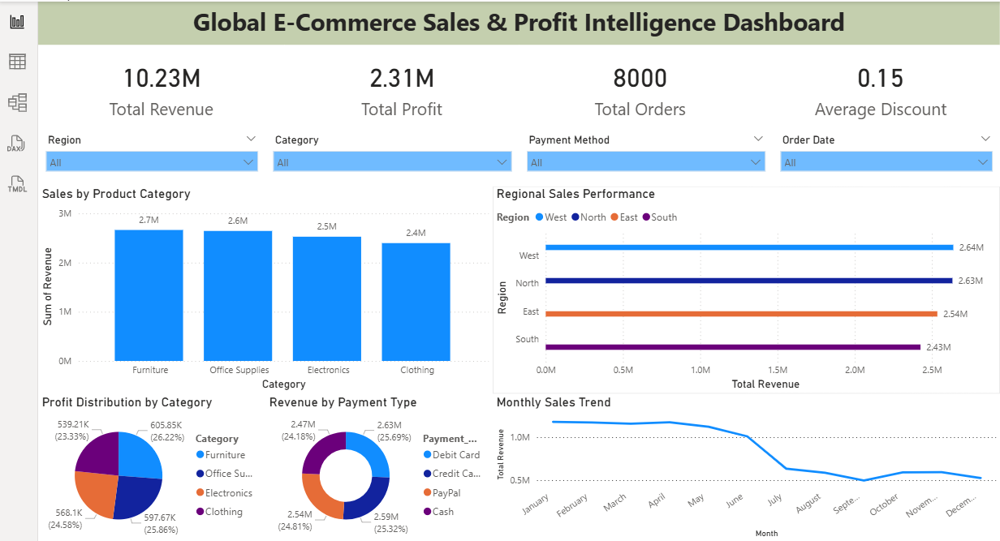

## Global E-Commerce Sales & Profit Intelligence Analysis

## Project Overview

This project analyzes global e-commerce transaction data to evaluate overall business performance, sales distribution, profitability, and customer purchasing patterns. The analysis aims to transform raw transaction data into meaningful insights that support data-driven decision-making.

The project integrates SQL for data querying, Excel for data preprocessing, Python for exploratory data analysis, and Power BI for interactive dashboard visualization.

The final deliverable is a Power BI dashboard that provides insights into revenue trends, profit distribution, regional sales performance, and customer payment behavior.

## Objectives

The main objectives of this project are:

Analyze global e-commerce sales performance

Evaluate revenue and profit trends

Identify high-performing product categories

Compare sales performance across regions

Understand payment method distribution

Monitor monthly sales patterns

Present insights through an interactive dashboard

## Tools & Technologies Used
## MySQL

Used for:

Data querying

Aggregations and KPI calculations

Revenue and profit analysis

## Microsoft Excel

Used for:

Data cleaning

Data validation

Data formatting and preprocessing

## Python

Used for exploratory data analysis (EDA).

Libraries used:

Pandas

NumPy

Matplotlib

Seaborn

## Power BI

Used to create an interactive dashboard for business insights and KPI visualization.

## Dataset Description

The dataset contains 8,000 global e-commerce transaction records including:

Order Date

Region

Product Category

Sales Revenue

Profit

Payment Method

Discount

Customer details

These fields were used to analyze sales performance and generate business insights.

## Key Performance Indicators

The dashboard highlights the following KPIs:

Total Revenue: 10.23M

Total Profit: 2.31M

Total Orders: 8000

Average Discount: 0.15

These metrics provide a quick overview of overall business performance.

## Dashboard Features

The Power BI dashboard provides multiple analytical views including:

Sales by Product Category

Displays revenue generated across different product categories:

Furniture

Office Supplies

Electronics

Clothing

Furniture and Office Supplies generate the highest revenue.

## Regional Sales Performance

Compares revenue performance across regions:

West

North

East

South

The West region generates the highest revenue, followed closely by North and East.

## Profit Distribution by Category

Shows the percentage of profit contribution from each product category.

This helps identify which categories generate the most profit.

## Revenue by Payment Type

Analyzes customer payment preferences:

Debit Card

Credit Card

PayPal

Cash

This insight helps businesses understand customer payment behavior.

## Monthly Sales Trend

Displays revenue performance across months to identify seasonal patterns and sales fluctuations.

The dashboard shows higher revenue in the early months of the year with gradual changes throughout the year.

## Dashboard Preview

## Key Insights

Important insights derived from the analysis include:

Total revenue reached 10.23 million, generating 2.31 million in profit.

Furniture and Office Supplies are the top performing product categories.

The West region leads in revenue generation.

Payment methods are evenly distributed across customers.

Sales trends vary throughout the year, indicating seasonal patterns.

These insights can help businesses optimize product strategy, pricing decisions, and regional sales focus.

## Project Workflow

The project followed a structured data analytics workflow:

Data collection from the e-commerce dataset

Data cleaning and preprocessing in Excel

SQL queries for revenue and KPI analysis

Python exploratory data analysis

Power BI dashboard development for visualization

## Author

Nagendra V Sagar

